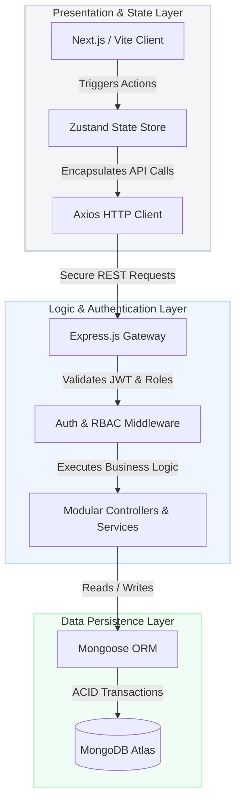
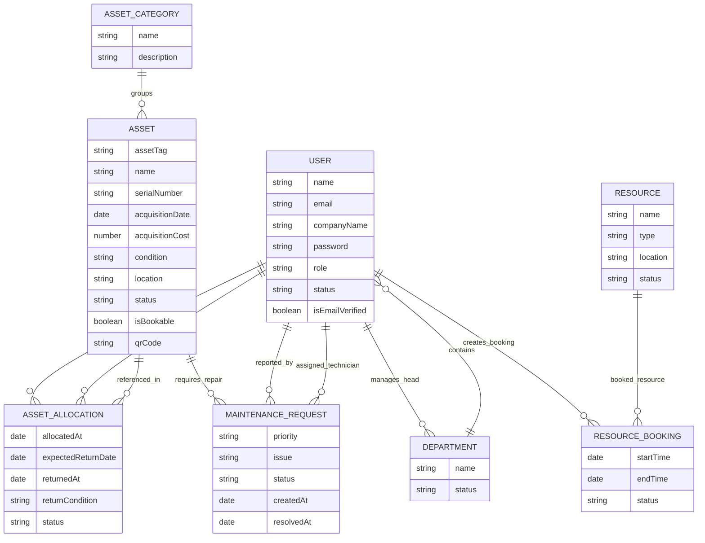

# AssetFlow

> Enterprise Asset & Resource Management System, Reimagined for People.

[](https://react.dev/)
[](https://nodejs.org/)
[](https://www.mongodb.com/)
[](LICENSE)

Live Demo: **[Live Demo URL]**  
Backend REST API: **[Backend API URL]**

---

## 1. The Vision & Problem Solved

In modern organizations, thousands of dollars and countless hours are lost annually in the friction of administrative overhead. Teams grapple with fragmented spreadsheets, double-allocated hardware assets, clashing room/resource bookings, and forgotten maintenance lifecycles. 

**AssetFlow** is designed to eliminate this administrative debt. Crafted with a cozy, highly-intuitive user experience, AssetFlow unifies asset tracking, room/resource reservations, and maintenance lifecycles into a single source of truth. By combining bulletproof database validation with interactive Kanban views, AssetFlow transitions enterprise resource tracking from a chore into a seamless experience.

---

## 2. Core Features (The "Wow" Factor)

### ⚡ The Concurrency Conflict Engine
To prevent the double-allocation of hardware or overlapping time slots for shared rooms/resources, AssetFlow implements a rigorous concurrency control layer:
- **Asset Allocation Lock:** Evaluates asset availability in atomic operations. Attempts to allocate already assigned items return a `409 Conflict` containing the current holder's details, guiding managers to request a structured transfer instead.
- **Resource Booking Overlap Resolver:** Enforces time-slot integrity via backend overlap queries: `(startTime < Booking.endTime) AND (endTime > Booking.startTime)`. Validated bookings reject overlapping slots at the database level, avoiding race conditions.

### 🔐 Dynamic RBAC (Role-Based Access Control)
Secured at both the routing level and state layers, AssetFlow supports five distinct roles:
*   **Admin:** Complete environment control, including user provisioning and categories.
*   **Manager:** Operations coordinator for asset procurement and allocations.
*   **Auditor:** Inspects logs, compliance status, and history.
*   **Technician:** Assigned to repairs, updates maintenance Kanban boards.
*   **Employee:** Requests assets, views personal dashboard, and registers bookings.

### 📋 Drag-and-Drop Maintenance Kanban
Visual ticket tracking for repairs. Tickets flow seamlessly through custom lanes (**Pending**, **Approved**, **In Progress**, **Resolved**, and **Cancelled**). State changes trigger automated updates and re-assign asset status (e.g., transition to `maintenance` or back to `available`).

### 🚀 "One-Click" Demo Mode
Designed specifically for hackathon evaluators. A custom state-interception layer allows you to instantly populate the application with rich, simulated mock assets, categories, users, and allocations directly in the browser—all without running command-line seeding scripts or manual entry.

---

## 3. System Architecture

AssetFlow employs a hybrid data access strategy. We prioritize **high-read throughput** on the client-side dashboard calendars and metric gauges by leveraging Zustand for local caching and optimistic UI updates. Concurrently, we guarantee **strict transactional consistency** on the backend by executing Mongoose checks during asset status transitions and resource bookings.



---

## 4. Database Schema

The core database schemas are structured for modular relations, preserving audit trails while keeping data normalized.



---

## 5. API Endpoints Reference

### Authentication Endpoints
| Method | Endpoint | Description | Auth Required |
| :--- | :--- | :--- | :--- |
| `POST` | `/api/v1/auth/register` | Register a new organization admin account | No |
| `POST` | `/api/v1/auth/login` | Authenticate credentials and get cookies/JWT | No |
| `GET` | `/api/v1/auth/me` | Retrieve verified details of current session | Yes |
| `POST` | `/api/v1/auth/logout` | Revoke session and clear cookies | Yes |
| `POST` | `/api/v1/auth/refresh` | Issue a new access token using a refresh token | Yes |
| `POST` | `/api/v1/auth/admin/users` | Admin/Manager: Provision a new employee credential | Yes |

### Asset Management Endpoints
| Method | Endpoint | Description | Auth Required |
| :--- | :--- | :--- | :--- |
| `GET` | `/api/v1/assets` | Get filtered, paginated list of company assets | Yes |
| `POST` | `/api/v1/assets` | Register a new physical asset | Yes (Admin) |
| `GET` | `/api/v1/assets/:id` | Get details, allocations, and maintenance history | Yes |
| `PATCH` | `/api/v1/assets/:id` | Update specification fields on an asset | Yes (Admin) |
| `DELETE` | `/api/v1/assets/:id` | Remove asset record from the system | Yes (Admin) |

### Asset Allocation Endpoints
| Method | Endpoint | Description | Auth Required |
| :--- | :--- | :--- | :--- |
| `POST` | `/api/v1/allocations` | Assign an available asset to an employee | Yes (Admin/Mgr) |
| `PATCH` | `/api/v1/allocations/:id/return` | Check in returned asset and note condition | Yes (Admin/Mgr) |
| `GET` | `/api/v1/allocations/my-allocations`| List current user's assigned assets | Yes |
| `GET` | `/api/v1/allocations/overdue` | List all allocations past return date | Yes (Admin/Mgr) |

### Resource Bookings & Metrics
| Method | Endpoint | Description | Auth Required |
| :--- | :--- | :--- | :--- |
| `POST` | `/api/v1/bookings` | Book shared space/equipment (conflict checked) | Yes |
| `GET` | `/api/v1/bookings` | List all bookings across the company | Yes |
| `GET` | `/api/v1/bookings/my-bookings` | List logged-in user's reservations | Yes |
| `GET` | `/api/v1/dashboard/metrics` | Retrieve calculated KPI aggregates | Yes (Admin) |

---

## 6. Local Setup & Running

Follow these instructions to spin up the local development environments.

### Prerequisites
- Node.js (v18.x or v20.x recommended)
- pnpm (v11.x or higher) or npm (v10.x or higher)
- MongoDB instance (Local community server or Atlas cluster)

### 1. Clone the Repository
```bash
git clone https://github.com/your-org/assetflow.git
cd assetflow
```

### 2. Configure Environment Variables
Create a `.env` file in the `backend/` directory:
```env
PORT=4000
MONGODB_URI=mongodb://localhost:27017/assetflow
NODE_ENV=development
CLIENT_URL=http://localhost:5173
JWT_ACCESS_SECRET=your_super_secret_access_key
JWT_REFRESH_SECRET=your_super_secret_refresh_key
```

Create a `.env` file in the `frontend/` directory:
```env
VITE_API_URL=http://localhost:4000
VITE_API_BASE_URL=http://localhost:4000/api/v1
```

### 3. Spin Up the Backend
```bash
cd backend
pnpm install
pnpm run dev
```

### 4. Spin Up the Frontend
```bash
cd ../frontend
pnpm install
pnpm run dev
```

The application client should now be running at `http://localhost:5173`.

---

## 7. Future Roadmap (The Enterprise SaaS Vision)

AssetFlow is designed with SaaS scale in mind. Our roadmap details a clear trajectory from a single-company utility to a high-scale Enterprise SaaS platform:

- **Phase 2: Multi-Tenant Architecture:**
  - Transition DB models to store `tenantId` context, allowing organizations to self-register.
  - Implement tenant isolation at the query level.
  - Support custom domain mapping and custom organization branding.
- **AI-Powered OCR Asset Onboarding:**
  - Leverage camera scans to extract serial numbers, model names, and manufacturer labels automatically from barcodes/invoices, populating inventory fields instantly.
- **Predictive Maintenance:**
  - Train ML classification models on ticket logs and asset ages to flag items requiring inspection *before* they break down, reducing structural downtime.
